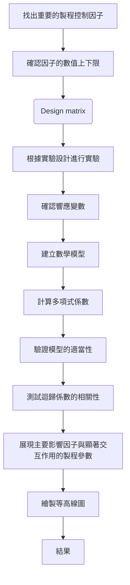

# What is Response surface methodology 
 

# Why we need them ?  

> 實驗中存在兩個甚至以上的數量型態的因子(獨立變數)，如果以一般的全因子實驗(Full Factorial Experiment)展開，實驗的成本過高；若利用雙因子實驗(Two Level Factorial Experiment)規劃方法，對於較複雜高階曲面反應，又無法由實驗結果反映實際的狀況。
 
- RSM 是一個最佳化的過程。找到或是改進多個製程因子最佳水準的過程
- Find the sweet spot for multi-responses $\rightarrow$ find the contour plot

# How to implement?

1. **Response surface design**
2. **Response surface Optimization**

### 執行步驟:

1. 篩選適當變數或控制因子
2. 完成一階反應曲面(Mountain climbing)
3. 往最佳路徑前進尋求大約合理的參數範圍
4. 搭配DOE，完成二階反應曲面
5. 找最佳解
6. 以重複試驗確認最佳解

在靠近最佳點(最大值/最小值)再改用CCD的實驗方法。
一開始可以先用傳統的 Factorial method (steepest descent) ，利用較少的實驗數找到各因子的影響程度

 {#Central composite design}
## 中心複合設計方法 CCD(Central Composite Design)

- 角點實驗(Cube / corner points)
    
    數量為 $2^K$ ，K代表因子數量
    
- 軸點實驗(Axial point  or star point)
    
    數量為 2K ，K代表因子數量
    
    - 如果需要有可旋性(rotability)
        
        
- 中心點實驗(center points)
    
傳統的實驗，中心點實驗都會重複執行，作為評估實驗誤差的參考
需要存在重複執行的中心點實驗， Nc = 3 - 5 次
我們的目標是最佳點出現在中心實驗點的位置，因此若假設實驗中心點接近 max / min response ，我們也會希望這個中心實驗點的標準差有一定的準確度。
因此，藉由多次實驗(隨著因子數目的增加，重複的次數會增加甚至到5-6次)，確認這個實驗值的反應有足夠的可靠度，同時確認中心點與邊界點的變異數不會差異太大(門檻多少?) 

|||k=2|k=3|k=4|k=5|
|:-:|:-:|:-:|:-:|:-:|:-:|
|CCD|$Factorial\ Point\ 2^k$|4|8|16|32|
||$Star\ Point\ 2k$|4|6|8|10|
||$Center\ Point\ n_c$|5|5|6|6|
||$Total$|13|19|30|48|
|$3^k Design$| |9|27|81|243|
|$\alpha的選擇$|$Spherical\ design\ \alpha = \sqrt{k}$|1.4|1.73|2|2.24|
||$Rotatable\ design\ \alpha = {n_f}^{0.25}$|1.4|1.68|2|2.38|

- **角點實驗(Cube /Corner points)** 
    數量為 $2^K$ ，K代表因子數量
    
- **軸點實驗(Axial point  or star point)**
    數量為 2K ，K代表因子數量
距離中心點的距離為$\alpha$
如果需要滿足rotability ，則須滿足下面這個條件
$\alpha = (F)^{1/4}$
其中 F 為 角點實驗的數量，對於 $2^k$的因子實驗，$F=2^k$
    
- **中心點實驗**
    傳統的實驗，中心點實驗都會重複執行，作為評估實驗誤差的參考
    需要存在重複執行的中心點實驗， Nc = 3 - 5 次
    我們的目標是最佳點出現在中心實驗點的位置，因此若假設實驗中心點接近 max / min response ，我們也會希望這個中心實驗點的標準差有一定的準確度。
    
	因此，藉由多次實驗(隨著因子數目的增加，重複的次數會增加甚至到5-6次)，確認這個實驗值的反應有足夠的可靠度，同時確認中心點與邊界點的變異數不會差異太大(門檻多少?) 
 
## Stationary point of the fitted surface

- 兩個特徵值都是負值，代表stationary point 是最大值
如果一正一負代表是鞍點(saddle point) 
兩個特徵值都是正值，response matrix 屬於正定矩陣，代表stationary point 是最小值

 
 
---
## 基本名詞解釋

- Rotatable 到底有什麼用 ?
**(note from AI)**
Rotability 在設計實驗中是一個重要的特性。
基於以下幾點考量
1. 預測精度的均勻性
	Rotable 確保設計實驗點在設計空間內，預測響應的精度是均勻的(uniform)，無論在哪個方向，只要距離中心點距離相同，預測的方差就相同。最佳化，在設計空間內對不同的方向探索最佳解，而Rotability 保證了探索的公平性

2.  減少方向偏差
實驗對稱的設計簡化響應曲面擬合與分析的流程，因為距離方差僅考慮距離不考慮方向。

### 採用 Rotable 方式設計實驗的考量

- Rotable 的實驗設計通常屬於二階響應曲面模型，如果實驗只需要一階模型，rotable 的設計並非必須
- 實驗設計成本
Rotable 的實驗設計點比較多，需要較高的實驗成本
- 實驗目標的探索方向非對稱
如果實驗的因子某些方向比其他方向更重要，那rotability 就並非是首選的方式

### Rotability 設計的方法

1.中心複合設計(Central composite design, CCD)
2. Box-behnken 設計

- 什麼情況下不適用factorial 或 fractional design 方法

---

## 可使用工具
- Free
    - [RStuio](https://www.rstudio.com/categories/programming/)
    - [PyDOE](https://pythonhosted.org/pyDOE/rsm.html)
- Commercial
    - minitab

# Reference 
- [NIST Statistics Handbook](https://www.itl.nist.gov/div898/handbook/pri/section3/pri33.htm#Response%20Surface(method))
- [NIST - Process Improvement](https://www.itl.nist.gov/div898/handbook/pri/pri.htm)
- [Central Composite Design for Response Surface Methodology and Its Application in Pharmacy](https://www.intechopen.com/chapters/74955)
- [Open educator - Response surface](https://www.theopeneducator.com/doe/Response-Surface-Methodology)
- [Stat 503 - Response Surface Methods and Designs](https://online.stat.psu.edu/stat503/book/export/html/681)

