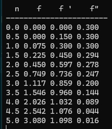

[演算法筆記] Euler methods 


## Algorithm

Initial value problem 
$y' = f(x,y) , a \le t \le b, y(a) = \alpha$

> input : endpoints
> a, b ; 邊界大小

### Procedure: 
Step 1.
$set\ h = (b-a) / N$
$t=a$
$y_0=alpha; alpha為初始值$

Step 2. For i = 1,2,....N , do step 3 , 4 recursively

Step 3. 
計算下一個 y 值
set $y_i = y_{i-1} + h* f(t,w)$ 

疊代到下一個 t值 
$t= a + i * h$ 

Step 4.
輸出新的 y值
output (t,w)

Step 5. Stop 

----
## Explaination

以solving blasius equation 為例




## Python code
<details>
<code>
	
```python
import numpy as np
import matplotlib.pyplot as plt 
# EX1. 
# solve the ode : dv/dt = 3*t**2 + 1
# analytical solution : v = t**3 + t + c   
def myfun(t,v):
 return 3*t**2 +1 
 
def analytical_sol(t,v):
 return t**3 + t + 0.3
  
h=.01
t = np.arange(0,3+h,h)
y = np.zeros(len(t)) 
dydt = np.zeros(len(t))
v_0 = 0.3
dydt_0 = 1


y[0] = v_0 + dydt_0*h
dydt[0] = dydt_0

y_ana = analytical_sol(t,v_0)

for idx, s in enumerate(t):
 if idx > 0 : 
    dydt[idx] = myfun(s,y[idx])
    
    y[idx] = y[idx-1] + h * dydt[idx-1]

  
fig = plt.figure()
plt.plot(t,y,label='euler method')
plt.plot(t,y_ana,'r-.',label='analytical sol')
plt.legend()
plt.xlabel('time t')
plt.ylabel('velocity V')
plt.show()


 
 
```
</code>

</details>


<details>

<code>

```python
import numpy as np
import matplotlib.pyplot as plt 
# EX2. 
# solve the blasius ode : 2f''' + f*f'' = 0

  
h=.5
t = np.arange(0,5+h,h)
f = np.zeros(len(t)) 
dfdn = np.zeros(len(t))
d2fdn2 = np.zeros(len(t))

# init conditions
# f = 0 , f'_0 = 0 , f''_0 = 0 , f''_inf = 1 
f_0=0
dfdn_0 = 0
d2fdn2_0 = 0.3
f[0] = f_0
dfdn[0] = dfdn_0
d2fdn2[0] = d2fdn2_0 

for idx in np.arange(1,len(t)):
    df3dn = -f[idx-1]*d2fdn2[idx-1]/2 
    d2fdn2[idx] = df3dn * h + d2fdn2[idx-1] 
    dfdn[idx] = d2fdn2[idx-1] * h + dfdn[idx-1]
    f[idx] = dfdn[idx-1] * h + f[idx-1] 


print (" "*2+ 'n'+ " "*4 +'f' + " "*4 + 'f \' ' + " "*3 + 'f\" ') 
print('-'*23)
for i in range(len(t)):
    print(f'{t[i]} {f[i]:.3f} {dfdn[i]:.3f} {d2fdn2[i]:.3f}')

 
    
fig,(ax1,ax2) = plt.subplots(1,2,figsize=(10,5))
ax1.plot(t,dfdn,label='velocity')
ax2.plot(t,f,label='f')
plt.legend()
plt.xlabel('n')
plt.ylabel('velocity v/u_inf')
plt.show()

```
	
</code>
	
</details>

解 blasius equation 是一個很好的例子
首先需要先將原本的多次微分方程式拆乘多個聯立一次微分方程

**Original equation**
$2f'''=-f*f''$
拆解成
$$
\begin{aligned}
y_1&=f\\
y_2&=f'=\large{}\frac{dy_1}{dn}\\
y_3&=f''=\large\frac{dy_2}{dn}\\
y_4&=f'''=\large-\frac{1}{2}y_1y_3
\end{aligned}
$$
初始條件為 
$$
\begin{aligned}
y_1(0)&=f(0)=0\\
y_2(0)&=f'(0)=0\\
y_3(0)&=f''(0)=0.3\\
\end{aligned}
$$
假設 $\Delta x$ 是 0.5 ,代表x 一次增加 0.5 (當然實際數值計算會採用更小的 遞增值,來達到更精確的計算結果) 

畫成表格後
|x|f|f'|f''|f'''|
|-|-|-|-|-|
|0|0|0|0.3|0|
|0.5|||||

問題為 那下一個 f(0.5) , f'(0.5),  f'''(0.5)為多少？ 
由於剛才已經有 f'''(0) 代表的為 $[ f''(0.5) - f''(0) ]/ 0.5 = f'''(0)$
因此, 可以求出 
$f''(0.5) = f''(0)+0.5*f'''(0)$

同理
$f'(0.5) = f'(0)+0.5*f''(0)$
$f(0.5) = f(0)+0.5*f'(0)$

因此,可以將表格更新為
|x|f|f'|f''|f'''|
|-|-|-|-|-|
|0|0|0|0.3|0|
|0.5|0|0.15|0.3|0.3|

繼續往下算可以得到

|n|f|df|df2|df3|
|-|-|-|-|-|
|0.0 | 0.000 | 0.000 | 0.300 | -0.000 |
|0.5 | 0.000 | 0.150 | 0.300 | -0.000 |
|1.0 | 0.075 | 0.300 | 0.300 | -0.011 |
|1.5 | 0.225 | 0.450 | 0.294 | -0.033 |
|2.0 | 0.450 | 0.597 | 0.278 | -0.063 |
|2.5 | 0.749 | 0.736 | 0.247 | -0.092 |
|3.0 | 1.117 | 0.859 | 0.200 | -0.112 |
|3.5 | 1.546 | 0.960 | 0.144 | -0.112 |
|4.0 | 2.026 | 1.032 | 0.089 | -0.090 |
|4.5 | 2.542 | 1.076 | 0.044 | -0.056 |
|5.0 | 3.080 | 1.098 | 0.016 | -0.025 |


>[!Note]
實際物理的應該是 
df2(0) = 0.332 
when $n \rightarrow 5$ $, f' \rightarrow 1$
因為 dn 設定的值比較大, 如果設定小一點, 也會比較準確

### Ref 
- https://ricwen.blogspot.com/2020/05/eulers-method.html
 